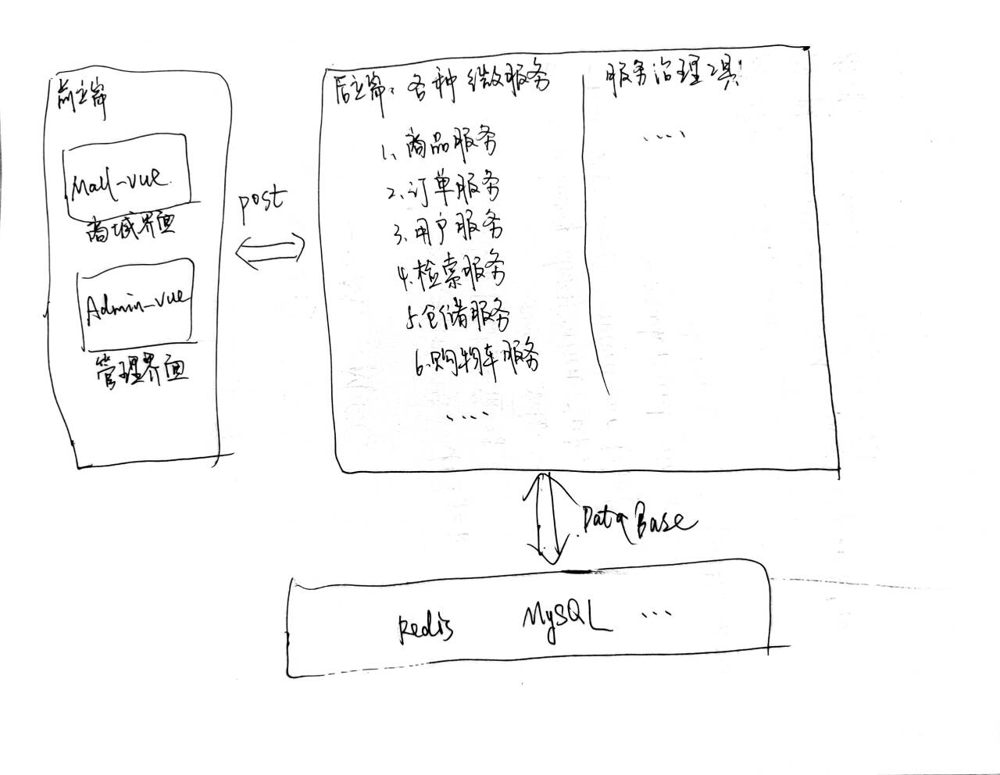

# Framework —— 整体框架

## 初步框架 23/12/12



* 计划：先从实现商品服务开始

```text
商品服务 -> 用户服务 -> 简单把前端搭起来 -> 订单服务 -> 检索服务 -> ...
```

技术栈：

* 后端：
    — java spring boot
    — maven
    — 微服务架构：spring could、 Docker
    — ...
* 前端：
    — Vue
    — ...
* 数据库：
    — MySQL
    — MongoDB
    — Redis
    — ...
* 其他：
    — Docker
    — Nginx
    — Git
    — ...

